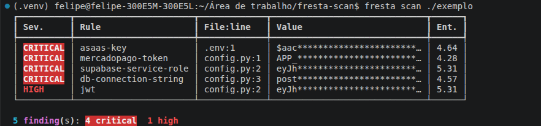

# Keyhound

[](https://github.com/felipedelyra-arch/keyhound/actions/workflows/ci.yml)
[](https://pypi.org/project/keyhound/)
[](https://pypi.org/project/keyhound/)
[](LICENSE)

Detector de credenciais expostas em código, com cobertura para serviços
brasileiros que ferramentas como gitleaks e trufflehog não reconhecem:
Mercado Pago, Asaas, Pagar.me, Cielo, PagSeguro, chave Pix, certificado
digital A1 e a chave `service_role` do Supabase.



## Por que existe

Durante o desenvolvimento é comum colar a chave direto no arquivo para
testar — e esquecer. O código vai para o repositório e a chave vai junto.
Há robôs varrendo o GitHub atrás exatamente disso: o intervalo entre
publicar e a chave ser usada por terceiros costuma ser de minutos.

Remover a chave do arquivo não resolve: ela continua no histórico do Git,
recuperável por qualquer pessoa com acesso ao repositório.

## Instalação

```bash
pip install keyhound
```

Requer Python 3.11 ou superior.

## Uso

```bash
keyhound scan .                        # varre o diretório atual
keyhound scan ./src -m high            # só severidade alta ou acima
keyhound scan . -f json                # saída para pipeline
keyhound scan . -f sarif               # saída para o GitHub code scanning
keyhound scan . --fail-on critical     # sai com código 1 se achar crítico

keyhound history .                     # varre todo o histórico do git
keyhound history . -n 100              # só os 100 commits mais recentes
keyhound history . -f json
```

O valor do segredo é sempre mascarado na saída — na tela, no JSON, no
SARIF e no relatório.

### Validação ativa

```bash
keyhound scan . --validate
```

Consulta o próprio serviço para saber se a credencial encontrada ainda
funciona. Separa o que é histórico do que é incidente: uma chave
**ativa** precisa ser revogada agora.

Suportado hoje: GitHub, Slack, Stripe e Mercado Pago. As chamadas são de
leitura, feitas por HTTPS direto no endpoint oficial de cada serviço, e
só acontecem com a flag explícita.

**Use apenas em credenciais suas ou que você tenha autorização para
testar.**

### Relatório para não técnicos

```bash
keyhound report . -o relatorio.html --client "Nome da Empresa"
keyhound report . -o relatorio.html --validate
```

Gera um arquivo HTML para o dono da empresa, o jurídico ou a auditoria:
resumo em linguagem simples, tabela de achados, o que fazer em cada caso
e a leitura pela LGPD (Art. 46 e Art. 48). Abre em qualquer navegador e
pode ser impresso ou salvo em PDF.

O relatório é técnico e não constitui parecer jurídico. Trate-o como
confidencial: ele aponta onde estão as falhas.

## O que detecta

**Globais** — AWS, GitHub, Slack, chave privada PEM, JWT, string de
conexão de banco, Google API, Stripe, senha e token em atribuição literal.

**Brasileiros** — Mercado Pago, Asaas, Pagar.me/Stone, MerchantKey da
Cielo, token do PagSeguro/PagBank, `service_role` e chave secreta do
Supabase, chave Pix aleatória (EVP) e senha de certificado A1.

A regra do `service_role` merece destaque: essa chave ignora todas as
políticas de Row Level Security do Supabase. Vazada no frontend, expõe o
banco inteiro. É visualmente idêntica à chave `anon`, que é pública e
inofensiva — o Keyhound distingue as duas.

## Pre-commit hook

Bloqueia o commit automaticamente quando encontra credencial. No
`.pre-commit-config.yaml` do seu projeto:

```yaml
repos:
  - repo: https://github.com/felipedelyra-arch/keyhound
    rev: v0.3.0
    hooks:
      - id: keyhound
```

Depois:

```bash
pip install pre-commit
pre-commit install
```

A partir daí, todo `git commit` passa pelo Keyhound. Se encontrar algo de
severidade média ou acima, o commit é recusado.

## GitHub Action

No `.github/workflows/security.yml` do seu projeto:

```yaml
name: Secret scan

on: [push, pull_request]

jobs:
  keyhound:
    runs-on: ubuntu-latest
    steps:
      - uses: actions/checkout@v4
      - uses: felipedelyra-arch/keyhound@v0.3.0
        with:
          fail-on: critical
```

Para varrer também o histórico completo:

```yaml
      - uses: actions/checkout@v4
        with:
          fetch-depth: 0
      - uses: felipedelyra-arch/keyhound@v0.3.0
        with:
          scan-history: "true"
```

O `fetch-depth: 0` é necessário porque, por padrão, o checkout traz
apenas o último commit.

### Achados na aba Security

Com a saída SARIF, os achados aparecem na aba **Security → Code scanning**
do repositório, anotados na linha do código:

```yaml
permissions:
  contents: read
  security-events: write

jobs:
  keyhound:
    runs-on: ubuntu-latest
    steps:
      - uses: actions/checkout@v4
      - uses: actions/setup-python@v5
        with:
          python-version: "3.12"
      - run: pip install keyhound
      - run: keyhound scan . --format sarif > keyhound.sarif
        continue-on-error: true
      - uses: github/codeql-action/upload-sarif@v3
        with:
          sarif_file: keyhound.sarif
          category: keyhound
```

## Reduzindo ruído

Ferramenta que grita demais é desinstalada. O Keyhound filtra em três
camadas antes de reportar:

- caminhos listados no `.keyhoundignore`
- valores que são claramente placeholder (`xxxx`, `<your-key>`,
  `${API_KEY}`, `CHANGEME`)
- chaves de exemplo que circulam em documentação oficial

Crie um `.keyhoundignore` na raiz do projeto:

```
tests/fixtures/
**/*.lock
docs/exemplos/
```

## Desenvolvimento

```bash
git clone https://github.com/felipedelyra-arch/keyhound.git
cd keyhound
python -m venv .venv && source .venv/bin/activate
pip install -e ".[dev]"
pytest
```

## Contribuindo

Veja [CONTRIBUTING.md](CONTRIBUTING.md). Regras novas para serviços
brasileiros são especialmente bem-vindas.

## Licença

Apache License 2.0 — veja [LICENSE](LICENSE).